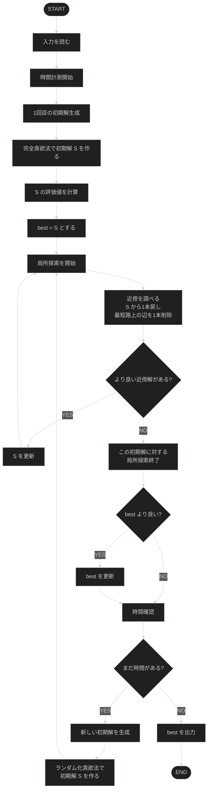

# プログラミング演習2 グループワーク
T=1.229s である。
コンピュータはだいたい1秒に10^8回計算できるので、オーダーが10^8を超えないように気を付ける。
# 命名規則
- 初めは小文字
- ローマ字読み使わない

# 関数一覧
```c
int dijkstra(int N, int Lmat[maxN][maxN], int v0, int d[maxN], int p[maxN])←一旦ヒープ使う方にした 
```
```c
void neighborhood
```
グラフに対しダイクストラ法で最短経路の長さを求める。intで長さを返す。  
・ダイクストラ法の関数  
・構成法(貪欲法,ランダム生成)の関数  
・改善法(多スタート局所探索法)の関数
# 変数一覧
```C
int N, M; //頂点数, 辺数
struct edge_data edge[maxM]; //辺データを表す変数
int W[maxM]; //辺の重みを格納する配列
int v0, v1; //始点, 終点を表す
int k; //消す辺の数
int d[maxN], p[maxN]; //始点から各頂点までの最短距離、最短経路木での親頂点を格納する
int 
```

```c
こういう風に書けばC記法でシンタックスハイライトされる
printf("hello world!")
```

# 細かい仕様
- 初期解生成はSの切り落とす辺の重みを1000000にすることによって実現
- 初期状態のSと作業中のSと最良解のSをもつ


# フローチャート
以下にmain.cの(大まかな)フローチャートを示す。

