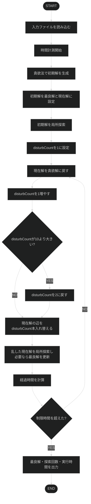
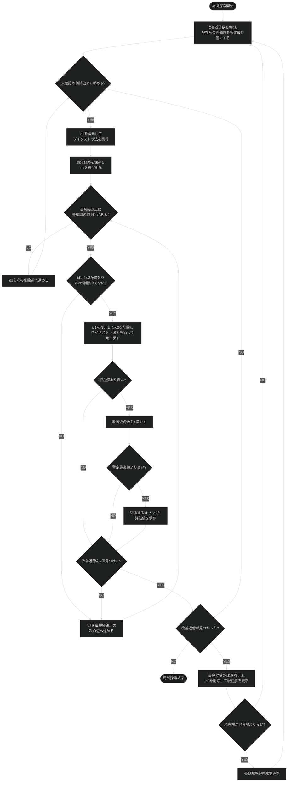

# プログラミング演習2 グループワーク

重み付き無向グラフから指定された本数の辺を取り除き、始点から終点までの最短経路長を最大化するプログラムである。

# 実行方法

メインプログラムは第1引数から制限時間を受け取り、標準入力からデータファイル名を読み込む。制限時間を省略した場合は1秒となる。

WSLでは次のコマンドで全データを実行できる。

```bash
./run_all.sh
```

Windowsでは次のバッチファイルを使用する。

```bat
run_all.bat
```

どちらのスクリプトも`binvec`を5回実行して時間の合計`T`を求める。data162系列の制限時間には`3*T`、それ以外には`T`を使用し、実行結果を`results.txt`へ出力する。

# 入力データ

データファイルは次の形式で記述する。

```text
N M
u_1 v_1 w_1
...
u_M v_M w_M
v0
v1
k
bestvalue
```

- `N`: 頂点数
- `M`: 辺数
- `u_i`, `v_i`, `w_i`: 辺の両端点と重み
- `v0`, `v1`: 始点と終点
- `k`: 取り除く辺の本数
- `bestvalue`: 既知の最良値

# 関数一覧

```c
int parent(int i);
int left(int i);
int right(int i);
void insert(struct cell *H, int *adr, int i, int a, int v);
void decrease_key(struct cell *H, int *adr, int i, int a);
int delete_min(struct cell *H, int *adr, int hsize);
void upheap_sort(struct cell *H, int *adr, int i);
void downheap_sort(struct cell *H, int *adr, int last);
int dijkstra(int N, int Lmat[maxN][maxN], int v0, int v1, int d[maxN], int p[maxN]);
void cutEdge(int Lmat[maxN][maxN], struct edge_data edges[maxM], int id);
void restoreEdge(int Lmat[maxN][maxN], struct edge_data edges[maxM], int id);
struct solution greedy(int N, int K, int Lmat[maxN][maxN], int edgeIdMat[maxN][maxN], struct edge_data edges[maxM], int v0, int v1);
struct solution disturbInitialSolution(int N, int M, int K, int Lmat[maxN][maxN], struct edge_data edges[maxM], int v0, int v1, struct solution *basesolution, int disturbCount);
void searchLocal(int N, int K, int Lmat[maxN][maxN], int edgeIdMat[maxN][maxN], struct edge_data edges[maxM], int v0, int v1, struct solution *bestsolution, struct solution currentSolution, int goodNeighborCount);
int makeNeighborAndTry(int N, int K, int Lmat[maxN][maxN], int edgeIdMat[maxN][maxN], struct edge_data edges[maxM], int v0, int v1, struct solution *bestsolution, int id1, int id2);
void showAnswer(struct solution bestsolution, int M, int K, char *fname, struct edge_data edges[], int bestvalue);
void showValue(struct solution bestsolution, int M, int K, char *fname, struct edge_data edges[], int bestvalue);
```

# 定数と構造体

```c
#define maxN 200
#define maxM 400
#define maxK 20
#define inf 1000000

long long dijkstraCount = 0;

struct edge_data
{
  int u;
  int v;
  int w;
};

struct solution
{
  int edgeId[maxK];
  int count;
  int value;
};

struct cell
{
  int key;
  int vertex;
};
```

- `edge_data`: 辺の両端点と重みを保持する。
- `solution`: 取り除く辺のID、その本数、始点から終点までの最短経路長を保持する。
- `cell`: ダイクストラ法のヒープで、距離と頂点番号を保持する。
- `dijkstraCount`: ダイクストラ法を呼び出した回数を数える。

# 主な変数

- `Lmat`: 辺の重みを保持する隣接行列。辺が存在しない場合や削除中の辺には`inf`を設定する。
- `edgeIdMat`: 2頂点間に対応する辺IDを保持する行列。
- `edges`: 辺IDから両端点と重みを取得するための配列。
- `greedysolution`: 貪欲法で生成した初期解。
- `currentSolution`: 攪乱と局所探索の対象となる現在解。
- `bestsolution`: 探索中に得られた最良解。
- `disturbCount`: 初期解から入れ替える辺の本数。

# 探索方法

1. 貪欲法で、現在の最短経路上から削除後の評価値が最大となる辺を1本ずつ選び、初期解を生成する。
2. 初期解に対して局所探索を行う。
3. 貪欲解を基準に、削除中の辺と未削除の辺を`disturbCount`本ずつ入れ替える。
4. 攪乱した解に対して局所探索を行い、より良い解が見つかれば最良解を更新する。
5. `disturbCount`を2から10まで変化させながら、制限時間を超えるまで手順3と4を繰り返す。

局所探索では、削除中の辺を1本復元し、そのときの最短経路上の辺を1本削除して近傍解を作る。改善近傍を2個見つけるか全候補を調べるまで探索し、見つかった改善近傍のうち評価値が最大の交換を現在解へ反映する。改善近傍がなくなった時点で局所探索を終了する。

# フローチャート

以下にmain.cの(大まかな)フローチャートを示す。



## 局所探索

以下にsearchLocalのフローチャートを示す。


